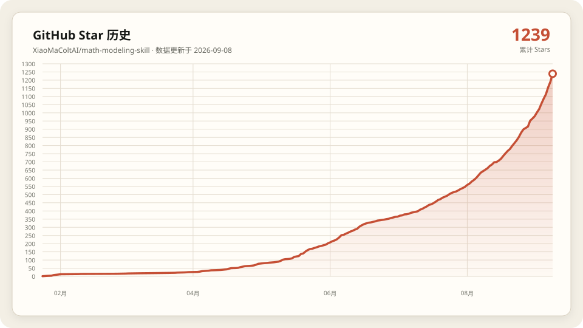

# 🎯 Math Modeling Skill

<div align="center">

**面向数学建模竞赛与建模项目的三阶段工作流**

[](VERSION)
[](SKILL.md)

**关注我**

[](https://blog.csdn.net/SJbeITenginner?spm=1010.2135.3001.5343)
[](https://www.zhihu.com/people/27-85-7-72-95/posts)
[](https://www.xiaohongshu.com/user/profile/6497dd69000000001c02ab98)

</div>

---

## 📖 简介

本 Skill 将数学建模任务拆分为 **建模分析 → 代码实现 → 论文撰写** 三个阶段。既可以按顺序完成整道题，也可以只执行其中一个阶段。

当前版本：[`1.2.0`](VERSION)

> 生成的论文仅供参考。论文结构与格式必须以目标竞赛当届官方规则和官方模板为准。

## ✨ 核心能力

- 🧠 **建模分析**：读题、检查附件、拆分子问题、选择模型、设计求解与验证方案。
- 💻 **双语言实现**：支持 Python 和 MATLAB，按选中的模型与功能动态检查依赖。
- 📊 **完整结果输出**：生成结果表格、原始数据图、模型运行过程图和最终结果图。
- 🎨 **出版级科学可视化**：先剖析数据和论证目标再选图，提供 Python/MATLAB 统一样式、色觉友好编码、SVG + 300 DPI PNG 导出与成图自检闭环。
- 🔁 **可复现运行**：记录随机种子、输入文件 SHA-256、运行时与依赖版本、关键参数和唯一复现命令。
- 🔎 **双引擎论文搜索**：并行调用 OpenAlex 与 AnySearch，按 DOI 或题名交叉核验。
- 📄 **Word / LaTeX 论文生成**：支持官方模板、嵌套主入口、整篇 LaTeX→DOCX、Word 原生 OMML 公式、真实 PDF 编译、权威资源—源码—产物哈希绑定和完整质量门禁。默认只生成 Word 论文，LaTeX 可选。
- 🛡️ **阶段内独立质检**：默认只在建模终检、最小可运行结果、编程终检、论文证据大纲和论文终检节点派发只读 Subagent，发现问题立即返工复验。
- 🤝 **可选 Subagent 协作**：用户可按需启用规则核验、附件盘点、文献与模型调研、算法原型、独立实验、双语言对照或术语核验；默认全部关闭。
- 🧩 **渐进式加载**：只读取当前阶段需要的角色规范、算法资料和工具说明。

## 🔄 三阶段工作流

<div align="center">
  
</div>

| 阶段 | 角色 | 核心任务 | 独立门禁 | 固定交付物 |
|:---:|---|---|---|---|
| ① | [建模手](references/roles/建模手/SKILL.md) | 理解题目、设计模型、定义算法和验证方案 | `M1` 建模终检 | `题目分析报告.md`、`术语表格.md` |
| ② | [编程手](references/roles/编程手/SKILL.md) | 编写并运行 Python/MATLAB，生成结果与图 | `P1` 最小可运行结果、`P2` 编程终检 | 代码、结果表格、三类各至少 3 张且覆盖全部子问题的候选图、`results/复现清单.json` |
| ③ | [论文手](references/roles/论文手/SKILL.md) | 基于真实结果构建论证并生成 Word 论文 | `W1` 证据大纲、`W2` 论文终检 | 至少 8 幅且覆盖全部子问题的正式图；默认交付 `完整论文.docx`；用户显式要求时同时交付 LaTeX 源码项目、PDF 与哈希清单 |

质检 Subagent 是阶段内只读验收者，不是第四个固定角色。默认只启用固定质检；其他协作仅在用户明确选择后运行。`P1` 在全量计算和正式出图前执行，`W1` 在长篇正文和双格式排版前执行；禁止等全流程结束后才首次质检。完整协议见 [Subagent 调度与阶段门禁](references/Subagent调度.md)。

### 阶段反馈

- 编程手发现公式、约束或参数无法实现时，携带实际报错返回建模手修正。
- 论文手发现关键结论缺少真实结果、图表或文献支撑时，返回对应阶段补齐。
- 任一独立门禁返回 `FAIL` 时，由原阶段执行者按证据修正并重新派发复验；主 Agent 不得自行覆盖失败结论。
- 修正后从被阻断阶段继续，不重复已经通过的阶段。

## 🚀 快速开始

### 推荐 Agent

本 Skill 可用于支持本地 Skills 或 Agent 工作流的工具，例如 Claude Code、Codex、Cursor、Trae 和 Qoder。具体加载方式以对应工具的当前文档为准。

### 安装

#### Git 克隆

```bash
git clone https://github.com/XiaoMaColtAI/math-modeling-skill.git
```

克隆后，将仓库放入所用 Agent 的 Skills 目录或按其方式加载本目录。

#### npx 安装

```bash
npx skills add https://github.com/xiaomacoltai/math-modeling-skill --skill math-modeling
```

也可以下载仓库 ZIP，解压后放入对应 Skills 目录。

### 使用示例

完整流程：

```text
使用数学建模 Skill 完成这道题，默认生成 Word 论文。
使用数学建模 Skill 完成这道题，同时生成 Word 和 LaTeX 论文。
使用官方 LaTeX 模板完成这道题，只交付完整 LaTeX 源码项目和编译 PDF。
使用数学建模 Skill 完成这道题，额外启用附件盘点、文献调研和算法原型 Subagent。
使用数学建模 Skill 完成这道题，除固定质检外不使用其他 Subagent。
```

单阶段执行：

```text
只做建模分析，输出题目分析报告和术语表格。
只实现现有模型，使用 MATLAB 运行并生成全部结果和图。
根据现有代码结果生成完整论文.docx。
根据现有代码结果和官方模板生成 LaTeX 论文并实际编译（需显式要求）。
```

主入口见 [SKILL.md](SKILL.md)。

## 📁 工作目录约定

- `SKILL_ROOT`：本仓库根目录，只读；角色规范、算法资料、脚本和模板从这里读取。
- `PROJECT_ROOT`：用户题目所在目录；所有运行产物只写入这里。
- 题目与附件保持只读；需要修改模板时，先复制到 `PROJECT_ROOT`。

典型产物结构：

```text
PROJECT_ROOT/
├── data/                         # 题目附件，只读
├── 题目分析报告.md
├── 术语表格.md
├── 问题1_求解.py 或 问题1_求解.m
├── results/
│   ├── 问题1_结果.csv
│   └── 复现清单.json
├── figures/
│   ├── raw_q1_*.svg / raw_q1_*.png
│   ├── process_q1_*.svg / process_q1_*.png
│   ├── result_q1_*.svg / result_q1_*.png
│   ├── raw_q2_* / process_q2_* / result_q2_*  # 其余问题依次覆盖
│   └── _qa/                       # 自动生成的灰度质检预览
├── 完整论文.docx                 # 默认交付的 Word 论文
├── 完整论文.conversion.json      # LaTeX→DOCX 输入/输出/模板哈希与警告记录（LaTeX 可选时）
├── 完整论文-LaTeX/               # LaTeX 源码项目（用户显式要求时）
│   ├── main.tex
│   ├── latex-project.json         # 模板来源、主入口及代码/图表资源绑定
│   ├── references.bib
│   └── 官方模板附带的 cls/sty/bst 等资源
├── 完整论文.pdf                  # 由 LaTeX 源码实际编译（用户显式要求时）
└── 完整论文.build.json           # 源码/PDF 哈希、工具版本、命令与门禁结果（用户显式要求时）
```

## 🛠️ 集成工具

| 工具 | 用途 |
|---|---|
| [科研可视化](tools/figure/SKILL.md) | 数据剖析、选图决策、Nature/SCI 出版级绘制、自检闭环、多格式导出 |
| [双引擎论文搜索](tools/paper_search/SKILL.md) | OpenAlex + AnySearch 搜索、融合和交叉核验 |
| [DOCX 工具](tools/docx/SKILL.md) | 官方模板、递归 LaTeX→DOCX、警告发布门禁、OMML 公式、三线表、修订、批注和校验 |
| [LaTeX 工具](tools/latex/SKILL.md) | 环境诊断、官方模板溯源、真实编译、哈希绑定、引用与 PDF 质量校验 |
| [Excel 工具](tools/xlsx/SKILL.md) | XLSX 模板处理、公式重算和错误检查 |
| [PDF 工具](tools/pdf/SKILL.md) | 读取题目 PDF，提取文本、表格和图片 |

### 双引擎论文搜索

```bash
python tools/paper_search/scripts/hybrid_scholar.py \
  --query "robust optimization vehicle routing" \
  --limit 10 \
  --json
```

- OpenAlex 可通过 `--email` 提供礼貌池邮箱。
- AnySearch 需要密钥时设置环境变量 `ANYSEARCH_API_KEY`。
- 正式检索默认同时运行两个引擎；单引擎参数只用于诊断。

### 动态依赖检查

Python 只检查实际需要的功能：

```bash
python references/roles/编程手/scripts/check_env.py \
  --features data visualization optimization
```

MATLAB 使用：

```matlab
addpath("references/roles/编程手/scripts");
report = check_matlab_env(["data", "visualization", "optimization"]);
```

## 🧮 算法资料

算法资料覆盖七类问题：

| 类别 | 代表方向 |
|---|---|
| 优化 | 线性、整数、非线性、多目标和启发式优化 |
| 预测 | 灰色预测、时间序列、回归和机器学习预测 |
| 评价 | AHP、TOPSIS、熵权、灰色关联和 DEA |
| 图论 | 最短路、网络流、生成树和匹配 |
| 统计 | 检验、聚类、降维和多元统计 |
| 综合 | 蒙特卡洛、排队、博弈、马尔科夫和微分方程 |
| 机器学习 | 随机森林、集成学习和异常检测 |

先读取 [算法索引](references/算法索引.md)，再按问题类型加载对应资料。每道子问题最多使用两个独立模型体系；物理题中同一机理的基础近似与高精度展开按一个模型族计数。

## 📄 论文生成

默认只生成 Word 论文；用户显式要求时同时生成 LaTeX/PDF 论文。当届官方提交要求仍决定实际可提交的版本。

Word：

```text
当届官方模板
  → python-docx 填充正文、表格和图片
  → LaTeX 严格转换为 Word 原生 OMML
  → 篇幅、公式、图表、编号引用和参考文献校验
  → DOCX 结构校验与渲染页数抽检
```

官方模板包含固定摘要页、编号页或占位符时，在原位置填充；只借用模板样式时，清除示例正文后再生成论文。

已有完整 LaTeX 主稿时，可使用 Pandoc 将整篇 `.tex` 及其 `\input`/`\include` 子文件转为 DOCX，公式保留为原生 OMML，并通过 `--template` 套用官方 Word 参考模板。Pandoc 警告默认阻断 DOCX 发布；转换成功会生成输入、输出、模板哈希和复现命令清单，交付前用 `verify-conversion` 重新计算全部哈希，随后仍须完成 DOCX 结构与渲染检查。

LaTeX（用户显式要求时）：

```text
当届官方 LaTeX 模板项目
  → doctor 检查引擎、文献、PDF 审计与 Pandoc 工具链
  → 完整复制 tex/cls/sty/bst/bib 与模板资源并记录模板哈希
  → 填充正文、原生 LaTeX 公式、真实图表和已核验文献
  → bind 将项目权威代码/图表与 LaTeX 内资源副本建立哈希绑定
  → 在隔离项目副本中使用 latexmk + 官方指定引擎真实编译
  → 副本/原始源码哈希不变且无未批准警告时，成对发布 PDF 与清单
  → 检查非空图表、全部子问题覆盖、引用、资源漂移、源码—PDF 哈希和实际页数
  → 检查空白页、页面尺寸、字体嵌入与位图 DPI
  → 打开 PDF 进行版面抽检
```

没有官方 LaTeX 模板时才使用内置中英文构建基线。LaTeX 分支交付完整源码项目、实际编译 PDF 和哈希绑定构建清单，不只交一个缺少模板依赖的 `.tex` 文件。安全编译链不启用 shell escape，因此论文直接引用同源导出的 PDF、PNG 或 JPG，不在编译期转换 SVG/EPS。同时生成两种格式时必须使用相同的数据、图表、公式、参考文献和结论，并分别通过质量校验。

CUMCM 默认以约 15000 字词单位、约 20 页作为完整度质量目标，但这不是官方最低要求。以 2026 年官方规范为例，摘要原则上不超过一页、正文不超过 30 页，附录不计入正文上限；校验器会按正文起始页和附录起始页单独计算正文页数，不再用 PDF 总页数代替。实际交付必须重新核对目标届次的官方文件。所有竞赛采用相同的至少 8 幅正式图质量基线，并要求每个子问题至少有一幅正式结果图；校验器还会检查公式、非空图表、题注与正文引用、参考文献双向对应和 PDF 完整性。降低默认目标必须记录官方条款或用户要求。

## 🎨 科学可视化

编程手不再从“喜欢哪种图”或现成模板出发，也不把 Nature/SCI 简化为配色和 DPI。它先核对数据结构、样本量、缺失、分布、异常值和单位，再为每张候选图写出一句话核心结论，选择叙事原型、主次面板、图例策略、统计口径与最终尺寸。默认采用克制、清晰、可编辑的 Nature/SCI 风格基线，但目标竞赛、学校或期刊的当届官方规范优先。

- Python 与 MATLAB 均提供统一字体、色觉友好调色板、线宽、面板和最终尺寸工具。
- 多面板图先声明主面板和辅助证据；信息量或证据权重不同时使用非对称布局，不机械等分成仪表盘。
- 面板内只保留短标题，优先直接标注或共享图外图例；限制密集逐点标记、装饰性纹理和冗余色条。
- 原始数据图、模型运行过程图和最终结果图每类至少生成 3 张逻辑候选图，合计至少 9 张，并覆盖题目全部子问题：每个子问题在三类中各至少 1 张，使用 `raw_q1_*`、`process_q1_*`、`result_q1_*` 等命名。共享数据也按不同子问题的分析目标生成不同视角，不复制同图凑数；同一图的 SVG、PNG 和灰度预览只计 1 张。
- 数据图按最终物理尺寸同时导出带可编辑文本的 SVG 与至少 300 DPI PNG，不用紧边界裁切破坏尺寸契约。
- 导出前除缺字、文字裁切和刻度重叠外，还会拦截长标题、超量图例、密集逐点标记、非零基线柱状图和冗余的 2×2 小矩阵 colorbar。
- 导出后自动生成灰度预览，并审计三类图每类至少 3 张、全部子问题覆盖、格式配对、PNG DPI、物理尺寸和 SVG 文本；Agent 必须在论文预计尺寸下复述第一视觉结论，检查遮挡、尺度、颜色区分和跨面板一致性，发现问题后回到代码重绘。
- “Nature/SCI 风格”是设计与质检基线，不是对任何期刊规范的替代或官方认证。

## 📸 示例展示

以下图表展示本项目可视化规范生成的候选图效果。

### 2025 年国赛 A 题：烟幕干扰弹的投放策略

<div align="center">
  
  <br>
  <em>投放方案对比与关键参数分析</em>
  <br><br>
  
  <br>
  <em>Pareto 前沿与策略效果对比</em>
</div>

### 2025 年国赛 B 题：碳化硅外延层厚度的确定

<div align="center">
  
  <br>
  <em>厚度拟合结果与方法对比</em>
  <br><br>
  
  <br>
  <em>误差分布与预测一致性分析</em>
</div>

## 🏆 适用场景

工作流可用于 CUMCM、MCM/ICM、APMCM、MathorCup、认证杯、数维杯等数学建模竞赛和一般建模项目。不同竞赛的页面、摘要、编号、页数和提交格式必须按当届官方要求配置。

## 📂 仓库结构

```text
math-modeling-skill/
├── VERSION
├── SKILL.md
├── README.md
├── CHANGELOG.md
├── assets/                         # 算法资料
├── imgs/                           # README 示例图
├── references/
│   ├── README.md                   # 渐进式导航
│   ├── 算法索引.md
│   └── roles/
│       ├── 建模手/
│       ├── 编程手/
│       └── 论文手/
├── tools/                          # DOCX、LaTeX、PDF、XLSX、论文搜索
└── tests/                          # 回归测试
```

## ✅ 验证

```bash
python -m unittest discover -s tests -v
python tools/docx/scripts/self_check.py
python -m compileall -q tools references/roles/编程手/scripts
```

回归测试覆盖双引擎搜索、公式转换、DOCX、LaTeX 模板与校验、Excel 重算、论文结构、动态依赖、复现清单和科学绘图工具。

## 📋 版本与更新日志

当前版本：[`1.2.0`](VERSION)

`1.2.0` 新增科研可视化工具融合，将 LaTeX 论文改为可选（默认只生成 Word），并重组可视化参考文档。详细内容见 [CHANGELOG.md](CHANGELOG.md)。

采用语义化版本 `MAJOR.MINOR.PATCH`：

- `MAJOR`：固定交付物、目录契约、命令参数或数据结构发生不兼容变化。
- `MINOR`：增加向后兼容的新能力。
- `PATCH`：向后兼容的错误修复、文档校正或测试补充。

完整记录见 [CHANGELOG.md](CHANGELOG.md)。

## ⭐ GitHub Star 历史

<div align="center">

[](https://github.com/XiaoMaColtAI/math-modeling-skill/stargazers)

该图每日读取 GitHub 官方累计 Star 数自动更新；画布为 16:9，纵轴每 50 Star 一格，并在当前数值上方保留一个完整刻度。

</div>

## 🙏 致谢

- [AnySearch Skill](https://github.com/anysearch-ai/anysearch-skill)：为学术垂直搜索提供参考。
- [Nature Skills](https://github.com/Yuan1z0825/nature-skills)：为科学可视化与写作方法提供参考。
- [SciPilot Figure Skill](https://github.com/Haojae/scipilot-figure-skill)：为数据剖析、图型决策、色觉可达性和成图自检闭环提供参考。

---

<div align="center">

**[算法索引](references/算法索引.md) · [使用文档](SKILL.md) · [角色说明](references/roles/) · [更新日志](CHANGELOG.md)**

</div>
